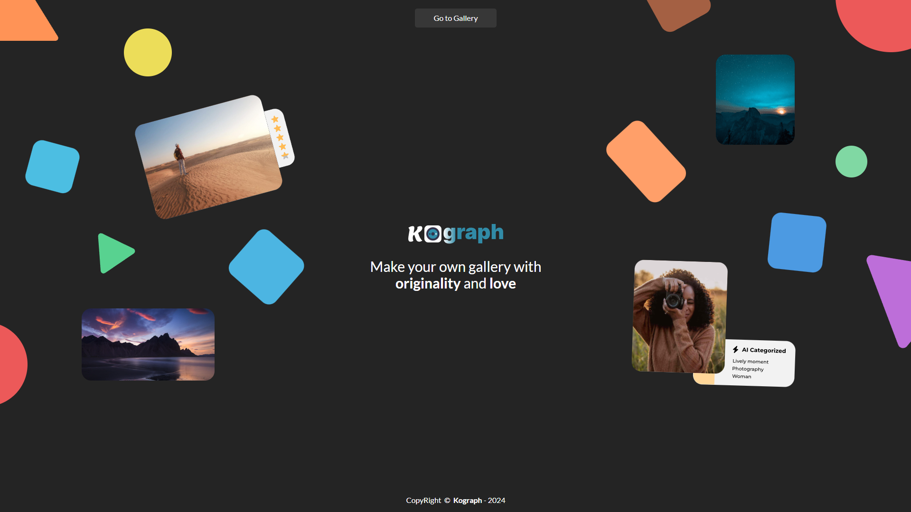

Kograph is an intelligent file gallery that harnesses AI tools to enhance user experience. This application is crafted to simplify file management and viewing, offering a wide array of intuitive AI-Powered features.
<br/>
<br/>
## Features

**⚡️AI Tools**
- Image Analysis
- Advanced Search
- Advanced User Activity
- Intelligent Organization
- Map with Image's location

**👩‍💻 Normal Tools**
- User Control
- Voice Control
  
*More features coming soon...*
<br/>
<br/>
## Deployment

**Client side run**

```bash
cd frontend
npm run serve
```

**Server side run**

```bash
cd backend
.\venv\Scripts\activate
python manage.py runserver 0.0.0.0:8000
```
<br/>

## Usage

You'll need to configure the environment variables for the application to work correctly. If you don't have access to AWS, don't worry, you just won't have access to the features that use artificial intelligence.

**/frontend/.env**

```bash
# SERVER URL
VUE_APP_SERVER_URL=

# FRONTEND URL
VUE_APP_BASE_URL=
```

**/backend/.env**

```bash
# YOUR APP NAME
APP_NAME=

# FRONTEND URL
FRONTEND_BASE_URL=

# EMAIL
EMAIL_APP_KEY='xxxx xxxx xxxx xxxx'

# AWS CREDENTIALS
aws_access_key_id=
aws_secret_access_key=
aws_session_token=
aws_region=
bucket=
```
<br/>

## Color Palette

| Color             | Hex                                                                |
| ----------------- | ------------------------------------------------------------------ |
| Primary Color |  #318ba7 |
| Primary Dark Mode |  #242424 |
| Primary Light Mode |  #ececec |
| Secondary Dark Mode |  #373737 |
| Secondary Light Mode |  #e2e2e2 |
<br/>

## Used libraries

[](https://vuejs.org/)&nbsp;&nbsp;
[](https://www.djangoproject.com/)&nbsp;&nbsp;
[](https://fontawesome.com/)&nbsp;&nbsp;
[](https://axios-http.com/)&nbsp;&nbsp;
[]()&nbsp;&nbsp;
[]()&nbsp;&nbsp;
[]()&nbsp;&nbsp;
[]()&nbsp;&nbsp;
[]()&nbsp;&nbsp;
[]()&nbsp;&nbsp;
[]()
<br/>

## 3rd Party Help

[](https://chat.openai.com/)&nbsp;&nbsp;
[](https://copilot.microsoft.com/)
